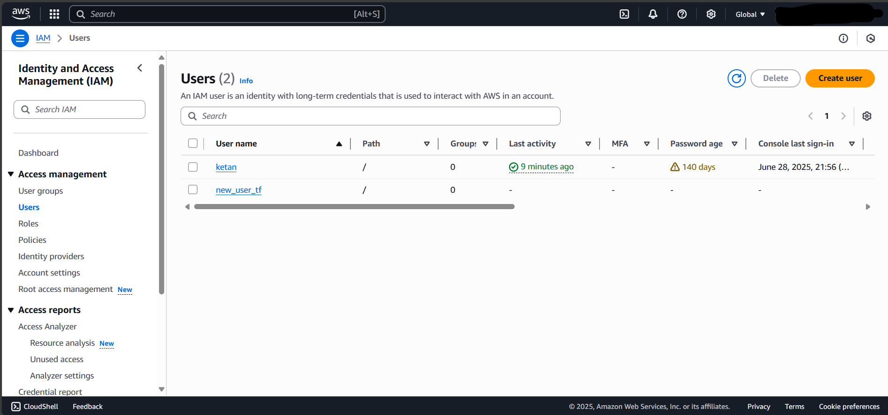

# 🗓️ Day 1: Introduction to Terraform + AWS IAM Project

## 🎯 Objective

- Understand Terraform basics: installation, providers, authentication
- Use Terraform to create IAM users and roles in AWS

---

## 📚 Concepts to Learn

### 1. What is Terraform?

- An open-source **Infrastructure as Code (IaC)** tool by HashiCorp
- Manages cloud infrastructure **declaratively**

### 2. Key Terraform Concepts

- **Providers**: Interface between Terraform and the service (e.g., AWS)
- **Resources**: Infrastructure objects (e.g., IAM user, EC2 instance)
- **Terraform CLI**: Tool to apply and manage code

---

## 🧪 Practical Setup

### ✅ Pre-requisites

- AWS CLI configured: `aws configure`
- Terraform installed: [Install Terraform](https://developer.hashicorp.com/terraform/downloads)

---

## 🛠️ Project: Provision IAM User and Role

### 📁 Folder Structure

```bash
terraform-iam-user/
├── main.tf
├── variables.tf
├── outputs.tf
```

## Output


